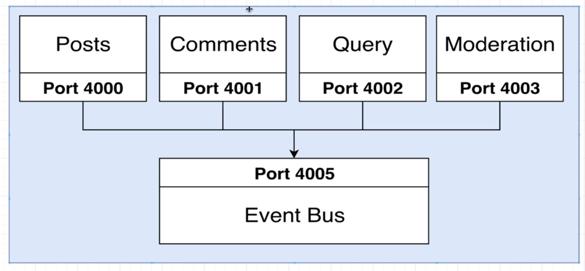

# blog-k8s

This project is a monorepo, organized using NPM Workspaces.
The frontend is a simple React App, build with CRA, and runs on port 3000.
This project serves as a playground, so if you e.g. want to add a BlogPost or Comment, a user has to refresh the page. 
This project aims to learn about Docker, docker-compose and Kubernetes.

## local development

Run `npm run start:client` to spin up the Frontend.
Run `npm run start:servers` to spin up all Backend services simultaniously.

## docker-compose

Run `make start` to create local Docker images.

For trouble shooting, run `docker-compose logs posts` , where `posts` can be replaced for any service in his project. 